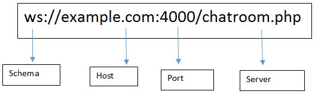

## WebSocket :

The WebSocket API is an advanced technology that makes it possible to open a two-way interactive communication session between the user's browser and a server. With this API, you can send messages to a server and receive event-driven responses without having to poll the server for a reply.

## Web Socket Handshake Protocol:

For establishing this full duplex connection client needs to send Websocket handshake request and server will send response for this request.

## Audience
This tutorial has been created for anyone who has a basic knowledge of HTML, Javascript and Node.js work. After completing this tutorial, the reader will be able to build moderately complex real-time websites, back-ends for mobile applications and push notification systems.

## Prerequisites
The reader should have a basic knowledge of HTML, JavaScript and Node.js. If the readers are not acquainted with these, we will suggest them to go through these tutorials first. We will be using Express to ease creating servers; it is not a prerequisite though.

## Difference Between WebSocket and Socket.io :

WebSocket is the communication Protocol that provides bidirectional communication between the Client and the Server over a TCP connection; WebSocket remains open all the time, so they allow real-time data transfer. When clients trigger the request to the server, it does not close the connection on receiving the response; it rather persists and waits for the Client or server to terminate the request.

Socket.IO is a library that enables real-time and full-duplex communication between the Client and the Web servers. It uses the WebSocket protocol to provide the interface. Generally, it is divided into two parts; both WebSocket vs Socket.io are event-driven libraries.

## WebSocket protocol schema 

## Why do we need WebSocket?

It provides full-duplex communication, which helps in persisting the connection established between the Client and the Web Server.
It also lives up to the standards and provides the accuracy and efficiency stream events to and from with negligible latency.
WebSocket removes the overhead and reduce complexity.
It makes real-time communication effortless and efficient.

## Why do we need Socket.IO:
I handle all the degradation of your technical alternatives to get full-duplex communication in real-time.
It also handles the various support level and the inconsistencies from the browser.
It also gives the additional feature room support for basic publish infrastructure and thinks like automatic reconnect.
Currently, AFAIK is the most used one and easier to help with vanilla web sockets.

## Server API

## Bookmark and Review

[Socket.io Documentation](https://socket.io/docs/v4/)

[Socket.io Server API](https://socket.io/docs/v4/server-api)

[Socket.io Client API](https://socket.io/docs/v4/client-api)

[Socket Testing Tool](https://amritb.github.io/socketio-client-tool/)

